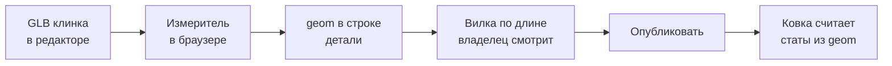

# Характеристики клинка из геометрии

Sep 24, 2026 · @Andy

## Эталон и три рычага

Эталонный клинок — середина своей вилки по длине, обычной для вилки ширины и ровного баланса. Он даёт ровно числа базы: скорость ×1, урон как у базы. В примере из задачи это 10–20.

Сила меча складывается на двух уровнях. **Вилка** задаёт крупный шаг: архаичный меч бьёт 5–9, двуручный 17–29, и это уже написано в базах. **Геометрия клинка** двигает меч только внутри его вилки, тремя рычагами:

| Рычаг | Что меряем | Что меняет | Размах |
| --- | --- | --- | --- |
| Длина | длина клинка, см | урон ↔ скорость | ×0.90…×1.10 урона, ×1.08…×0.92 скорости |
| Ширина | рабочая ширина, см | разброс мин–макс при том же среднем | разброс ×0.4…×1.6 |
| Баланс | центр тяжести силуэта | блок ↔ кровотечение | блок ±2 п.п., шанс кровотечения ±25 % |

Эталон каждой вилки:

| Вилка | Длина клинка, см | Середина, см | Эталонная ширина, см | Урон базы | Скорость базы | Блок базы |
| --- | --- | --- | --- | --- | --- | --- |
| Архаичный | 45–70 | 57.5 | 4.7 | 5–9 | ×1.12 | 0 |
| Короткий | 70–80 | 75 | 5.2 | 6–11 | ×1.06 | 8 % |
| Длинный | 85–90 | 87.5 | 3.3 | 7–13 | ×1.00 | 8 % |
| Полуторный | 95–105 | 100 | 3.8 | 11–19 | ×0.95 | 5 % |
| Двуручный | 110–150 | 130 | 4.8 | 17–29 | ×0.85 | 0 |

Эталонная ширина — медиана нынешних клинков вилки. Она хранится в конфиге числом и сама не пересчитывается: новая модель не сдвигает статы старых.

Пример из задачи в этих рычагах. Эталон 10–20, ×1. Такой же длины, но широкий — 13–17, ×1. Такой же длины, но узкий — 7–23, ×1. Самый длинный в вилке — 11–22, скорость ×0.92.

## Что снимаем с модели

Измеритель режет клинок на 24 полосы от рукояти к острию и в каждой берёт ширину и толщину по вершинам. Из этого профиля считаются пять чисел. На нынешних 36 клинках это уже прогнано.

| Число | Как считается | Размах в пуле | Куда идёт |
| --- | --- | --- | --- |
| Длина, см | от рукояти до острия | 45–132 | рычаг длины, вилка |
| Рабочая ширина, см | медиана ширины на 25–87 % длины | 1.6–6.7 | рычаг ширины |
| Центр тяжести (ЦТ) | центр площади силуэта: 0 — у рукояти, 1 — у острия | 0.34–0.54 | рычаг баланса |
| Расширение к концу | ширина на 67–87 % длины к ширине на 33–67 % | 0.68–1.43 | признак фальшиона |
| Изгиб спинки, % длины | снос линии обуха от прямой | 0.6–4.5 | признак сабли |

Рабочую ширину берём медианой середины, а не максимумом. Иначе усы у рикассо двуручника дают 11.5 см вместо 6. Ориентиры ЦТ: 0.50 — параллельные лезвия, 0.33 — чистый треугольник, выше 0.50 — клинок расширяется к концу.

### Как статы присасываются к модели



Мерит редактор, а не сервер. Сервер видит в GLB только габаритный ящик: там нет three.js, и вершины он не читает. В строку детали пишется геометрия, а не готовые статы. Покрутил формулу — и все клинки пересчитались, перезаливать модели не нужно.

Вилка подбирается по длине сама. Клинок, попавший в зазор между вилками (80–85, 90–95, 105–110 см), редактор подсвечивает и ждёт решения.

### Договор о модели — без него замер врёт

- Единицы — сантиметры.
- Начало координат — пята клинка (там, где он уходит в гарду).
- Клинок идёт по −Y, плоскость полотна — XY, лезвие смотрит в +X. Для однолезвийных это важно: по −X измеритель ищет спинку.
- Хвостовик и гарда — отдельными объектами или не в этом файле, иначе они попадут в длину и ЦТ.

Модель, у которой клинок идёт не по −Y, измеритель отказывает с понятной причиной.

⚠ Нынешние 36 клинков — процедурные заглушки. Их ширина сама считается из ручной оси (±14 %), то есть мерить их — круг «ось → геометрия → ось». Твои 40 моделей этот круг разрывают. У заглушек зависимость ширины от оси убираем.

## Длина → урон и скорость

Длина ставит клинок на место внутри его вилки: самый короткий — самый быстрый, самый длинный — самый тяжёлый. Это та же ось, что у клинка есть сегодня, только теперь она не проставлена руками, а измерена.

```latex
n_L = \mathrm{clamp}\left(\frac{L - L_{\text{сер}}}{L_{\text{пол}}},\ -1,\ +1\right)
```

```latex
\text{удар} = 1 + 0.10\,n_L \qquad \text{скорость} = 1 - 0.08\,n_L \qquad \text{ДПС} = (1 + 0.10\,n_L)(1 - 0.08\,n_L)
```

L — длина клинка, Lсер — середина вилки, Lпол — половина её ширины. Для длинного меча (85–90 см) это 87.5 и 2.5. Коэффициенты 0.10 и 0.08 — нынешние ручки `balance.craft.strike`, баланс не трогаем.

Удар умножается целиком, вместе с вкладом атрибутов, поэтому у героя любого уровня рычаг работает одинаково. Скорость — плоская часть скорости оружия, её бой умножает на все проценты скорости героя.

| Место в вилке | Длинный меч, см | Удар | Скорость | Ударов в минуту | ДПС |
| --- | --- | --- | --- | --- | --- |
| −1 самый короткий | 85 | ×0.90 | ×1.08 | 65 | ×0.972 |
| −0.5 | 86.3 | ×0.95 | ×1.04 | 62 | ×0.988 |
| 0 эталон | 87.5 | ×1.00 | ×1.00 | 60 | ×1.000 |
| +0.5 | 88.8 | ×1.05 | ×0.96 | 58 | ×1.008 |
| +1 самый длинный | 90 | ×1.10 | ×0.92 | 55 | ×1.012 |

ДПС меняется меньше чем на 3 %: длина меняет характер удара, а не силу. Крупный редкий удар нужен критам и кровотечению (оно считается от размера удара). Частый мелкий — статусам, прокам и вампиризму.

### Почему место в вилке, а не сантиметры

Между вилками урон уже растёт с длиной: от 57.5 до 87.5 см середина урона растёт с 7 до 10. Это примерно 0.9 % урона на 1 % длины. Если так же считать внутри вилки, клинки длинного меча (85–90 см) разойдутся всего на ±3 %. После округления этого не видно. А архаичные (45–70 см) разойдутся на ±20 %. Место в вилке даёт каждой вилке одинаковую палитру ±10 %.

### Что показал замер

У 7 из 36 клинков измеренная ось противоположна ручной. Ручная ставила их лёгкими по ощущению формы, а длина ставит тяжёлыми:

| Клинок | Длина, см | Ручная ось | По длине |
| --- | --- | --- | --- |
| Игольчатый, VIII | 68 | −1.0 | +0.84 |
| XIX | 90 | −1.0 | +1.00 |
| XVa | 104 | −1.0 | +0.80 |
| XV | 89 | −0.8 | +0.60 |
| XVI | 79 | −0.3 | +0.80 |
| Щучий язык, IX | 64 | −0.3 | +0.52 |
| Широкий двуручный | 124 | +1.0 | −0.30 |

Это узкие колющие клинки у верхнего края своей вилки. По правилу «длиннее — тяжелее» они становятся медленными. Их лёгкость остаётся в других рычагах: узкий — больше разброс, суженный — больше блок. Если такие клинки должны бить быстро, нужен другой рычаг скорости — см. решение 1 в конце.

## Ширина → разброс урона

Ширина не меняет ни средний урон, ни скорость — только то, насколько минимум и максимум расходятся от середины. Широкий клинок бьёт ровно, узкий — вразнобой.

```latex
s = \mathrm{clamp}\left(1 - 0.9\,\ln\frac{W}{W_0},\ 0.4,\ 1.6\right)
```

```latex
\text{мин} = \text{сер} - \text{пол}\cdot s \qquad \text{макс} = \text{сер} + \text{пол}\cdot s
```

W — рабочая ширина клинка, W₀ — эталонная ширина вилки. Сер и пол — середина и полуразмах урона базы: у 10–20 это 15 и 5. Логарифм делает «вдвое шире» и «вдвое уже» равными шагами. Потолок 0.4…1.6 — ровно твои 13–17 и 7–23.

| Ширина к эталону | Длинный меч, см | s | Из 10–20 | Из 7–13 (длинный) |
| --- | --- | --- | --- | --- |
| ×0.5 и уже | 1.65 | 1.60 | 7–23 | 5–15 |
| ×0.75 | 2.5 | 1.26 | 9–21 | 6–14 |
| ×1 эталон | 3.3 | 1.00 | 10–20 | 7–13 |
| ×1.5 | 5.0 | 0.64 | 12–18 | 8–12 |
| ×1.95 и шире | 6.4 | 0.40 | 13–17 | 9–11 |

Среднее остаётся на месте, поэтому ДПС ширина не двигает. Кровотечение тоже: оно считается от размера удара линейно.

Зачем это игроку: узкий клинок иногда валит с одного удара то, что широкий валит всегда с двух. Широкий предсказуем. Это выбор стиля, а не силы.

### Сколько разброса доживает до удара героя

Удар = урон оружия + вклад атрибутов, а разброс есть только у оружия. Замер настоящей цепочкой боя: воин, длинный меч ступени «Сломанный», 30-й уровень — +60 силы и +30 ловкости.

| Герой | Широкий 9–11 | Эталон 7–13 | Узкий 5–15 |
| --- | --- | --- | --- |
| 1-й уровень | 17.8–19.8 (±5.3 %) | 15.8–21.8 (±16 %) | 13.8–23.8 (±27 %) |
| 30-й уровень | 40.3–42.3 (±2.4 %) | 38.3–44.3 (±7.3 %) | 36.3–46.3 (±12 %) |
| 60-й уровень | 62.8–64.8 (±1.6 %) | 60.8–66.8 (±4.7 %) | 58.8–68.8 (±7.8 %) |

Отношение «узкий к широкому» держится на всех уровнях — в пять раз. А абсолют тает: к 60-му уровню узкий клинок гуляет лишь на ±8 %. На высоких ступенях эффект сильнее: цифры оружия растут ×1.3…×6, а атрибуты — нет. В подсказке к оружию игрок видит полные 9–11 и 5–15.

### Вилка не съедает ширину

Минимум и максимум катаются порознь, каждый ±15 %. Итог 20 000 бросков длинного меча — разброс после броска:

| Клинок | Минимум | Медиана | Максимум |
| --- | --- | --- | --- |
| Широкий 9–11 | 0 | 2 | 5 |
| Эталон 7–13 | 3 | 6 | 9 |
| Узкий 5–15 | 7 | 10 | 13 |

Широкий ни разу не выкатил разброса узкого. С эталоном они сходятся только на краях.

⚠ На маленьких числах округление съедает разницу. Архаичный 5–9 на первой ступени даёт 4–10 у узкого и 6–8 у широкого. Видно, но грубо. Со ступени «Крепкий» (×1.8) разница уже читается свободно.

## Баланс → блок и его цена

Клинок, сужающийся плавно, держит вес у руки и парирует лучше: **+блок, −кровотечение**. Клинок с параллельными лезвиями или тяжёлым концом рубит длинной кромкой: **+кровотечение, −блок**.

### Почему баланс — один рычаг на клинок и оголовье

У меча уже есть такая пара, только на оголовье (гнездо 4). Сейчас оно даёт блок +2 п.п. либо шанс кровотечения +25 %. ГДД запрещает продавать один статус в двух гнёздах (§23): вклады складываются, и две крайние детали дают вдвое больше.

Но у настоящего меча точка баланса и есть одно число: его даёт профиль клинка и вес навершия-противовеса. Поэтому делаем именно так. Обе детали сдвигают ОДНУ точку баланса, она зажата в ±1, и статы считаются только от неё. Продавец один, потолок — сегодняшний.

```latex
n_B = \mathrm{clamp}\left(\frac{0.45 - \text{ЦТ}}{0.10},\ -1,\ +1\right)
```

```latex
n_{\text{бал}} = \mathrm{clamp}\left(0.6\,n_B + 0.4\,a_{\text{оголовья}} + f_{\text{формы}},\ -1,\ +1\right)
```

```latex
\text{блок} = \text{блок}_{\text{базы}} + 0.02\,n_{\text{бал}} \qquad \text{шанс кровотечения} = 0.25\,(1 - 0.25\,n_{\text{бал}})
```

ЦТ — центр тяжести силуэта из замера. a — нынешняя ось оголовья (+1 — тяжёлый противовес). f — поправка фальшиона или сабли из следующего раздела. Числа 0.02 и 0.25 — нынешние ручки оголовья (`headBlock`, `bite.bleed`).

| ЦТ силуэта | Какой клинок | n\_B | Баланс (оголовье ровное) | Блок | Шанс кровотечения |
| --- | --- | --- | --- | --- | --- |
| 0.34 | XV, XVII — сужается от самой гарды | +1 | +0.6 | +1.2 п.п. | 21 % |
| 0.40 | XII, XX — сужается по всей длине | +0.5 | +0.3 | +0.6 п.п. | 23 % |
| 0.45 | эталон | 0 | 0 | 0 | 25 % |
| 0.49 | XIII, X — лезвия параллельны, сходятся у конца | −0.4 | −0.24 | −0.5 п.п. | 26.5 % |
| 0.54 | фальшион, копис — шире к концу | −0.9 | −0.54 | −1.1 п.п. | 28 % |

Полные ±2 п.п. блока берутся только парой: суженный клинок + тяжёлое навершие, или тяжёлый конец + лёгкое навершие. Детали вразнобой гасят друг друга:

| Клинок | Оголовье | Баланс | Блок | Кровотечение |
| --- | --- | --- | --- | --- |
| суженный (+1) | тяжёлое (+1) | +1 | +2 п.п. | 18.8 % |
| суженный (+1) | лёгкое (−1) | +0.2 | +0.4 п.п. | 23.8 % |
| тяжёлый конец (−1) | лёгкое (−1) | −1 | −2 п.п. | 31.3 % |

### Чем платим за блок — кровотечением, а не ударом

Кровотечение — это и есть урон, только во времени. Каждый стак тянет 4 % удара в секунду, при ударе в секунду висит около 1.5 стака. ±25 % шанса — это порядка ±1.5 % ДПС. Точное число даст замер в настоящем бою. За это — ±2 п.п. блока, то есть ±2.2 % эффективного здоровья при блоке 8 %. Развилка настоящая, но не решающая.

Платить ударом напрямую нельзя из-за оголовья. Оно кормит тот же баланс и стало бы второй осью ДПС — это запрет «одна ось ДПС», тест его стережёт. Хочешь цену именно ударом — решение 2 в конце.

⚠ У архаичного и двуручного меча блок базы равен нулю. Минус блока там упирается в ноль, и кровотечение достаётся даром. Это старый долг §7.2: лестница блока по классу ставит всем мечам 8 %.

## Фальшионы и сабли

Фальшион и сабля не получают новых статов. Они сдвигают клинок по двум уже существующим рычагам — длины и баланса. Получается ровно твой список, и ни одна форма не выходит за потолок прямых клинков.

| Форма | Рычаг длины | Баланс | Урон | Скорость | Блок | Кровотечение |
| --- | --- | --- | --- | --- | --- | --- |
| Фальшион | +1 шаг к тяжёлому | −0.4 к концу | больше | меньше | меньше | больше |
| Сабля | −1 шаг к лёгкому | +0.4 к руке | меньше | больше | больше | меньше |

```latex
n_L = \mathrm{clamp}(n_L^{\text{длина}} + f_L,\ -1,\ +1) \qquad f_L = +1\ \text{(фальшион)},\ -1\ \text{(сабля)}
```

Поправка баланса f = −0.4 или +0.4 идёт в формулу баланса из прошлого раздела. Оба рычага зажаты в ±1. Значит, фальшион никогда не бьёт сильнее самого длинного прямого клинка своей вилки. Ковка не создаёт мощности, которой нет в дропе — правило Р1 из ГДД.

### Четыре однолезвийных клинка из пула

| Клинок | Вилка | Как прямой | С формой |
| --- | --- | --- | --- |
| Фальшион | короткий | 6–11, ×1.09, блок 6.9 %, кровь 28.5 % | 6–12, ×1.01, блок 6.1 %, кровь 31 % |
| Падающий (копис) | архаичный | 5–9, ×1.12, кровь 28.3 % | 6–10, ×1.03, кровь 30.8 % |
| Серповидный (хопеш) | архаичный | 4–10, ×1.14, кровь 28.2 % | 4–11, ×1.05, кровь 30.7 % |
| Саблевидный | длинный | 6–14, ×0.98, блок 7.8 %, кровь 25.7 % | 6–13, ×1.06, блок 8.6 %, кровь 23.2 % |

ДПС всех четырёх остаётся в коридоре 0.98–1.01. Сакс («С прямой спинкой») — однолезвийный, но не расширяется и не изогнут. Он считается как прямой клинок.

### Как форма узнаётся по модели

1. **Однолезвийность ставишь ты** — это уже тег детали `edge: single`. По сетке заточку надёжно не увидеть.
2. **Фальшион** — однолезвийный и расширение к концу ≥ 1.15. Замер делит чисто: фальшион 1.32, копис 1.43, хопеш 1.31. У всех остальных клинков — не больше 1.12.
3. **Сабля** — однолезвийный и изгиб спинки ≥ 3 % длины. ⚠ На заглушках это не проверено: их спинки сами не прямые (сакс 2.9 %, фальшион 2.2 %), а заглушка сабли почти прямая (0.9 %). Пока метка сабли ставится руками. Порог проверю на твоих моделях.

Измеритель только предлагает форму, ты подтверждаешь одним выбором в строке детали.

## Все 36 клинков: замер и итог

Все 36 клинков укладываются в ДПС 0.97–1.01 от эталона своей вилки — разница между ними в характере удара, а не в силе. Посчитано на нынешних заглушках. Твои модели перепишут замер, формулы останутся.

Урон — на первой ступени, с уже умноженным рычагом длины, как его покажет подсказка. Скорость — вместе со скоростью базы. Оголовье везде ровное. Ось «была» — ручная из конфига, «стала» — из длины с поправкой формы. ⚠ — минус блока съеден нулём базы.

| Клинок | Вилка | Длина, см | Ширина, см | ЦТ | Форма | Ось: была → стала | Урон | Скорость | Блок | Кровотечение |
| --- | --- | --- | --- | --- | --- | --- | --- | --- | --- | --- |
| Куцый | архаичный | 45 | 3.3 | 0.47 | — | −0.6 → −1.0 | 5–9 → 4–9 | ×1.21 | 0.0 % ⚠ | 26 % |
| Короткий, IV | архаичный | 50 | 4.2 | 0.48 | — | −1.0 → −0.6 | 5–9 → 5–8 | ×1.17 | 0.0 % ⚠ | 26 % |
| С прямой спинкой | архаичный | 52 | 3.8 | 0.46 | — | −0.5 → −0.4 | 5–9 → 5–9 | ×1.16 | 0.0 % ⚠ | 25 % |
| Прямой, III | архаичный | 54 | 4.8 | 0.45 | — | −0.3 → −0.3 | 5–9 → 5–9 | ×1.15 | 0.0 % | 25 % |
| Серповидный, V | архаичный | 55 | 3.3 | 0.54 | фальшион | +1.0 → +0.8 | 5–9 → 4–11 | ×1.05 | 0.0 % ⚠ | 31 % |
| Широкий, II | архаичный | 57 | 4.9 | 0.38 | — | +0.3 → 0.0 | 5–9 → 5–9 | ×1.12 | 0.8 % | 22 % |
| Падающий | архаичный | 58 | 3.7 | 0.54 | фальшион | +0.8 → +1.0 | 5–9 → 6–10 | ×1.03 | 0.0 % ⚠ | 31 % |
| Листовидный, VI | архаичный | 60 | 5.7 | 0.44 | — | +0.5 → +0.2 | 5–9 → 5–9 | ×1.10 | 0.1 % | 25 % |
| Литой, VII | архаичный | 62 | 5.0 | 0.44 | — | +0.3 → +0.4 | 5–9 → 5–9 | ×1.09 | 0.1 % | 25 % |
| Щучий язык, IX | архаичный | 64 | 5.7 | 0.40 | — | −0.3 → +0.5 | 5–9 → 5–9 | ×1.07 | 0.7 % | 23 % |
| Длинный, I | архаичный | 66 | 5.4 | 0.44 | — | +1.0 → +0.7 | 5–9 → 5–10 | ×1.06 | 0.1 % | 25 % |
| Игольчатый, VIII | архаичный | 68 | 2.0 | 0.47 | — | −1.0 → +0.8 | 5–9 → 4–11 | ×1.04 | 0.0 % ⚠ | 26 % |
| Узорчатый | архаичный | 69 | 4.6 | 0.48 | — | 0.0 → +0.9 | 5–9 → 5–10 | ×1.04 | 0.0 % ⚠ | 26 % |
| Тупоконечный | архаичный | 70 | 6.2 | 0.49 | — | +0.6 → +1.0 | 5–9 → 6–10 | ×1.03 | 0.0 % ⚠ | 27 % |
| Заострённый, XIV | короткий | 72 | 3.2 | 0.38 | — | −1.0 → −0.6 | 6–11 → 5–11 | ×1.11 | 8.9 % | 22 % |
| Фальшион | короткий | 73 | 5.1 | 0.54 | фальшион | +0.6 → +0.6 | 6–11 → 6–12 | ×1.01 | 6.1 % | 31 % |
| Прямой, XIIIb | короткий | 75 | 5.2 | 0.49 | — | 0.0 → 0.0 | 6–11 → 6–11 | ×1.06 | 7.6 % | 26 % |
| Широкий, XXII | короткий | 78 | 5.6 | 0.41 | — | +1.0 → +0.6 | 6–11 → 6–12 | ×1.01 | 8.4 % | 24 % |
| Колюще-рубящий, XVI | короткий | 79 | 3.6 | 0.38 | — | −0.3 → +0.8 | 6–11 → 5–13 | ×0.99 | 8.8 % | 22 % |
| Широкий с долом, X | короткий | 80 | 5.9 | 0.47 | — | +1.0 → +1.0 | 6–11 → 7–12 | ×0.98 | 7.7 % | 26 % |
| Узкий, XI | длинный | 85 | 3.4 | 0.46 | — | −0.6 → −1.0 | 7–13 → 6–12 | ×1.08 | 7.9 % | 25 % |
| Классический, XII | длинный | 86 | 3.6 | 0.42 | — | 0.0 → −0.6 | 7–13 → 7–12 | ×1.05 | 8.3 % | 24 % |
| Ромбический, XVIII | длинный | 87 | 3.3 | 0.35 | — | +0.3 → −0.2 | 7–13 → 7–13 | ×1.02 | 9.2 % | 21 % |
| Широкий рубящий, XIII | длинный | 88 | 6.2 | 0.49 | — | +1.0 → +0.2 | 7–13 → 9–11 | ×0.98 | 7.5 % | 27 % |
| Саблевидный | длинный | 88 | 2.6 | 0.47 | сабля | −0.8 → −0.8 | 7–13 → 6–13 | ×1.06 | 8.6 % | 23 % |
| Гранёный, XV | длинный | 89 | 1.9 | 0.34 | — | −0.8 → +0.6 | 7–13 → 6–15 | ×0.95 | 9.2 % | 21 % |
| Узкий с рикассо, XIX | длинный | 90 | 3.0 | 0.48 | — | −1.0 → +1.0 | 7–13 → 8–14 | ×0.92 | 7.6 % | 26 % |
| Полуторный гранёный, XVII | полуторный | 98 | 2.1 | 0.34 | — | −0.5 → −0.4 | 11–19 → 9–20 | ×0.98 | 6.2 % | 21 % |
| Полуторный с двумя долами, XX | полуторный | 100 | 5.0 | 0.44 | — | +0.5 → 0.0 | 11–19 → 12–18 | ×0.95 | 5.1 % | 25 % |
| Полуторный классический, XIIa | полуторный | 102 | 3.8 | 0.42 | — | 0.0 → +0.4 | 11–19 → 11–20 | ×0.92 | 5.4 % | 24 % |
| Полуторный широкий, XIIIa | полуторный | 104 | 6.7 | 0.49 | — | +1.0 → +0.8 | 11–19 → 14–18 | ×0.89 | 4.5 % | 27 % |
| Полуторный узкий, XVa | полуторный | 104 | 1.6 | 0.34 | — | −1.0 → +0.8 | 11–19 → 10–23 | ×0.89 | 6.2 % | 21 % |
| Двуручный прямой | двуручный | 120 | 5.1 | 0.47 | — | 0.0 → −0.5 | 17–29 → 16–28 | ×0.88 | 0.0 % ⚠ | 26 % |
| Двуручный широкий с рикассо | двуручный | 124 | 6.0 | 0.48 | — | +1.0 → −0.3 | 17–29 → 17–27 | ×0.87 | 0.0 % ⚠ | 26 % |
| Пламенеющий | двуручный | 128 | 4.4 | 0.46 | — | −0.5 → −0.1 | 17–29 → 17–29 | ×0.86 | 0.0 % ⚠ | 25 % |
| Двуручный узкий с рикассо, XVIIIe | двуручный | 132 | 2.1 | 0.36 | — | −1.0 → +0.1 | 17–29 → 13–33 | ×0.84 | 1.1 % | 22 % |

Две дыры в пуле видны сразу. Двуручные занимают 120–132 см из вилки 110–150: лёгкого и тяжёлого двуручника нет (место в вилке только −0.5…+0.1). Полуторные — 98–104 из 95–105, самого короткого тоже не хватает. Если среди твоих моделей есть двуручники на 110–115 и 140–150 см, палитра закроется сама.

## Как это войдёт в игру

Геометрия ложится в данные детали, а статы считает тот же `bakeParts`, что сегодня читает ручную ось. Новых статов нет, новых строк в подсказке нет: разброс виден в строке урона, блок и кровотечение — в своих строках.

| Что | Где | Как |
| --- | --- | --- |
| Измеритель | новый `craftMesh/bladeGeom.ts` (из временного замера этой сессии) | одна функция для редактора (загрузка GLB) и для скрипта по заглушкам |
| Геометрия в данных | `weapon-parts[].geom`: длина, ширина, ЦТ, расширение, изгиб | пишет измеритель. Статы в деталь не пишутся — так уже сейчас требует схема |
| Эталоны и ручки | `balance.craft.blade`: вилки (длина, W₀), разброс (0.9, 0.4…1.6), баланс (0.45, 0.10, доля клинка 0.6), поправки форм | редактор, «Ковка → Баланс» |
| Длина | `bakeParts` (`craft.ts:324`) | ось клинка = n\_L из geom, дальше код тот же |
| Разброс | `scaleBaseStats` (`itemgen.ts:107`) — новый аргумент `shape.spread` | единственное место, где рождаются мин и макс |
| Баланс | `bakeParts`, блок оголовья (`craft.ts:340–354`) | блок и кровотечение считаются один раз, от n\_бал |
| Ось в редакторе | форма детали | у клинков меча `axis` только для чтения, считается из geom |
| Заглушки | `blades.ts:345–346` | убрать зависимость ширины и толщины от оси — иначе круг |

Разброс идёт в `scaleBaseStats`, а не вторым модом на вещи. Второй мод бой посчитал бы верно, но подсказка берёт первый и соврала бы. Ещё он потерялся бы при подъёме тира и сбил бы восстановление тира у старых сейвов. Разброс строго множительный: тир умножает цифры, и форма сохраняется от «Сломанного» до «Мифического».

Границы захода:

- **Только мечи.** Остальные 9 классов оружия остаются на ручной оси, пока для них нет моделей. Потом на эту систему переводим всё оружие и весь дроп (решение 5).
- **Дальность не трогаем.** Длинный клинок пока не бьёт дальше. По ГДД (§3.5) дальность вводится только вместе с обратной правкой дуги и замером в бою — это отдельный шаг.
- **Ковки на сервере ещё нет.** Сегодня её зовут только окно ковки и редактор. Когда она переедет на сервер, считать будет тот же общий код.
- **Найденные мечи.** Им уже назначается клинок для вида, но статы клинка к ним не применяются. С геометрией это станет заметно: на вид клинок широкий, а бьёт как эталон. См. решение 5.

## Проверки, сторожа и риски

Сила мечей не меняется, и главный замок «одна ось ДПС» остаётся. Падают тесты, завязанные на конкретные ручные оси — их переписываем.

### Что упадёт и чем станет

| Тест | Почему упадёт | Чем станет |
| --- | --- | --- |
| «Клинки базы дотягиваются до −1 и +1» | полуторные стоят на −0.4…+0.8, двуручные на −0.5…+0.1 | лампа в редакторе «в вилке нет лёгкого/тяжёлого клинка» — это задача для моделлера, а не ошибка кода |
| «На любой ступени есть тяжёлая и лёгкая форма» | знаки осей переехали | та же лампа по ступеням материала |
| Точные числа формы у XI (−0.6) и XII (0) | у XI теперь −1.0, у XII −0.6 | числа берутся из geom |
| Отношение ДПС на XIII (+1) и XIX (−1) | по длине XIII = +0.2, XIX = +1 | берём клинки, крайние по n\_L |
| «Скованное = найденное по урону» | мин и макс скованного теперь другие | сравниваем средний урон; или разброс получают и найденные (решение 5) |
| «Детали гнезда выглядят по-разному» (3D) | без оси часть заглушек может совпасть | прогнать; совпавшим — своя ширина в коде формы |

### Новые сторожа

1. Ширина не двигает среднее: середина урона до и после разброса равна с точностью до округления — на всех клинках и ступенях.
2. Разброс всегда в ×0.4…×1.6, какой бы ширины ни была модель.
3. Любая пара «клинок + оголовье» даёт блок в пределах ±2 п.п. и укус в пределах ±25 % — не больше сегодняшнего одного оголовья.
4. ДПС любого клинка — 0.97–1.02 от эталона вилки на бумаге. В настоящем бою героями 1/40/80 уровня — разброс не больше 5 %, как у нынешнего сторожа оси.
5. Широкий клинок не выкатывает разброса узкого — 20 000 бросков вилки.
6. Фальшион и сабля не выходят за ±1 ни по одному рычагу.
7. Измеритель на заглушках даёт ровно таблицу выше. Модель не по −Y и клинок вне всех вилок — отказ с причиной.

### Риски

- **ГДД §23 уже отвергал «вторую ось у клинка».** Причина была в ДПС: с двумя мечами вторая ось давала +5.8 % вместо +3.4 %. Ширина и баланс ДПС не двигают, складывать нечего. Запрет «статус в двух гнёздах» снимается одной точкой баланса. «Массу как колонку» не вводим. Всё равно §23 надо переписать явно, а не молча обойти.
- **Круг на заглушках.** Пока ширина заглушки зависит от ручной оси, замер меряет наши же ощущения. После снятия связи ширины уедут до ±14 %, и таблица сдвинется.
- **Подъём тира теряет запечённое** (долг §19). Разброс это переживёт, он живёт в `scaleBaseStats`. Длина и баланс теряются, как и сегодня. Пока подъём тира у скованного запрещён — безопасно.
- **Блок съеден нулём** у архаичного и двуручного меча: 11 клинков из 36 получают кровотечение бесплатно. Лечится лестницей блока §7.2 (решение 6).
- **Атрибуты размывают разброс.** К 60-му уровню узкий клинок гуляет лишь на ±8 %. Если этого мало, разброс можно применять ко всему удару (решение 3).

## Решения за тобой

Восемь вопросов перед реализацией. У каждого есть моя рекомендация, по ней считаны все цифры выше. Отмечай галку или пиши комментарий прямо к пункту.

- [ ] **1. Как длина двигает урон и скорость.** Рекомендую место в вилке, ±10 % (так посчитано). Решено: так и делаем. Границы вилок (45–70 … 110–150 см) и размах ±10 % урона / ∓8 % скорости выносятся в конфиг-редактор («Ковка → Баланс»): подбираются без кода, клинки пересчитываются сами. Клинок, который после правки вышел за свою вилку, упирается в ±1, а редактор подсвечивает его. Отклонённые варианты:
  - сантиметры: честная физика, но в длинной вилке (85–90) клинки разойдутся на ±3 % — этого не видно;
  - момент клинка (длина × ширина × ЦТ). Тогда XV и игольчатый — лёгкие, XIII и XIIIa — тяжёлые, как по истории и по ручной оси. Но ширина начинает менять и скорость, а твоё правило «широкий — тоже ×1» ломается.
- [ ] **2. Цена блока.** Рекомендую платить только кровотечением. Решено: так и делаем — за блок платит только кровотечение, ось ДПС остаётся одна (длина). Отклонённый вариант: ещё и ударом ±4 % при скорости ∓4 % (ДПС тот же). Цена варианта — оголовье станет второй осью ДПС, замок придётся переписать.
- [ ] **3. Разброс — на оружие или на весь удар.** Рекомендую пока на оружие: отношение «узкий к широкому» держится на всех уровнях. На весь удар — эффект не тает к 60-му уровню, но это правка боевой формулы для всего оружия, включая найденное. Решено: пока на оружие; к «на весь удар» вернёмся, если в игре разница будет не видна.
- [ ] **4. Сабля и кровотечение.** Сейчас по твоему «наоборот»: блока больше, кровотечения меньше. Но изогнутый клинок режет хорошо. На одном рычаге сабля не может получить и блок, и кровотечение сразу. Решено: оставляем «наоборот» — сабля зеркальна фальшиону по всем четырём статам: у нас АРПГ, а не симулятор фехтования. Отклонённый вариант: поправка баланса сабли = 0, остаётся только лёгкость (урон ↓, скорость ↑).
- [ ] **5. Найденные мечи тоже получают статы клинка.** Рекомендую да. Тогда вид меча = его цифры, и скованное снова равно найденному. Детали найденного и так выводятся из его uid, сейв не меняется. Цена: у всех найденных мечей двинется ДПС на ±3 % и разброс. Решено: да. И дальше на эту систему переводим всё оружие и весь дроп, а не только мечи.
- [ ] **6. Лестница блока §7.2.** Архаичному и двуручному мечу — базовые 8 % вместо 0. Рекомендую да, но с прогоном сима: это +2–3 % здоровья всем с этими мечами.

  Решено (мой выбор): не 8 %, а **2 %** архаичному и двуручному. Ровно столько, сколько снимает рычаг баланса (−2 п.п.), и рычаг становится двусторонним: блок у этих мечей ходит в 0–4 %, кровотечение больше не даром. Бафф живучести у ровного клинка — +2 % здоровья вместо +8–9 % при 8 %. Проверю замером в бою при врезке. Таблица выше посчитана со старым нулём: после правки у этих двух вилок блок = 2 % + 2 п.п. × баланс, и знаки ⚠ уходят.
- [ ] **7. Доля клинка и оголовья в балансе.** Рекомендую 60 / 40: клинок главнее, навершие всё ещё заметно. Крутится одним числом в редакторе.

  Решено: 60 / 40, доля клинка — ручка в редакторе «Ковка → Баланс».
- [ ] **8. Зазоры между вилками и края вилок.** Клинок 80–85, 90–95 или 105–110 см рекомендую относить к ближайшей вилке с предупреждением, а не отказывать. Для полной палитры нужны модели двуручников на 110–115 и 140–150 см и полуторного на 95–97 см.

  Отложено до замера твоих 40 моделей. Прогоню их через измеритель, добавлю сюда таблицу с их длинами и вилками — и тогда решим про зазоры. Границы вилок уже решено сделать ручками (решение 1), так что зазор можно будет закрыть и сдвигом границы.

После твоих ответов порядок работы такой: измеритель → geom в данных → длина и баланс в ковке → разброс → редактор → сторожа → правка §23 и §4 в ГДД.
